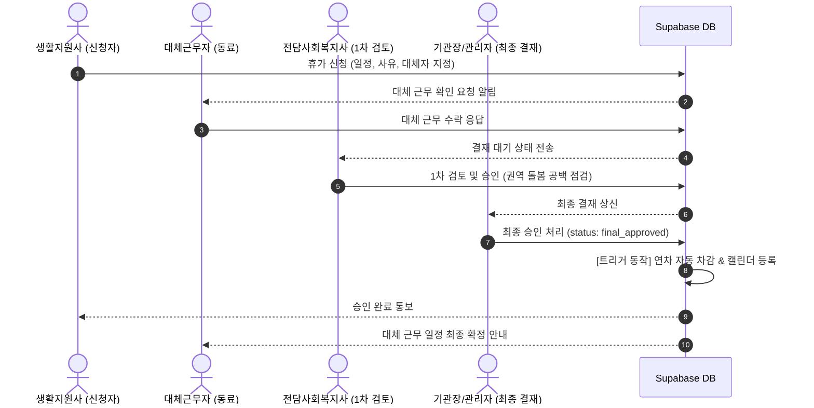
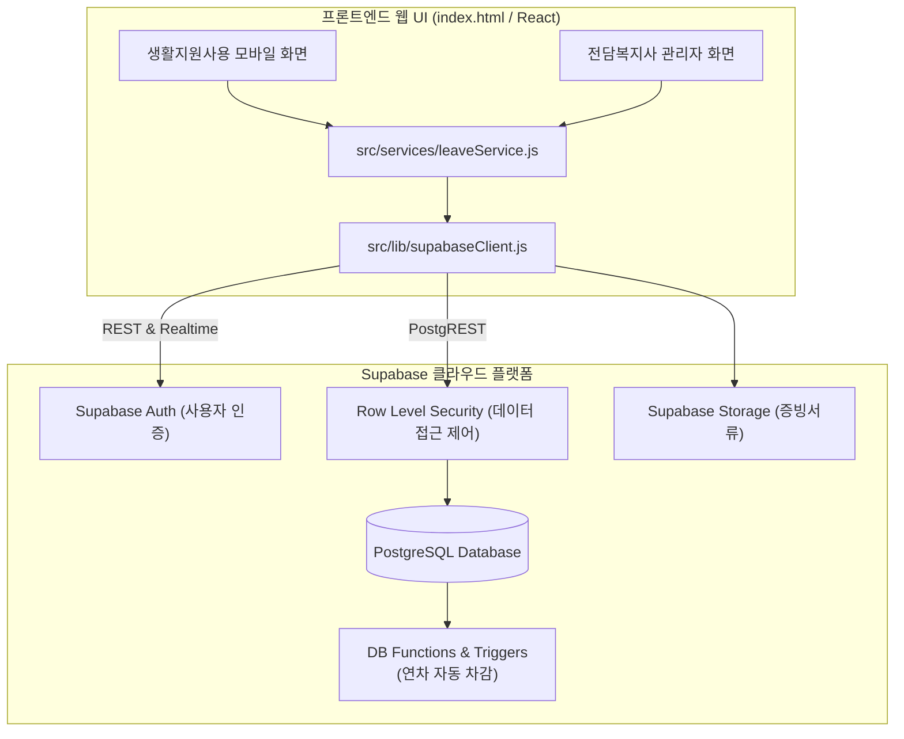

# 🌿 생활지원사 휴가관리 시스템 (CareLeave Manager)

> **노인맞춤돌봄서비스 수행기관 맞춤형 생활지원사 근태·휴가 관리 및 돌봄 공백 방지 솔루션**

[](https://opensource.org/licenses/MIT)
[](https://supabase.com/)
[](https://tailwindcss.com/)
[](https://developer.mozilla.org/)

---

## 📌 목차
1. [프로젝트 소개](#-프로젝트-소개)
2. [도입 배경 및 기대 효과](#-도입-배경-및-기대-효과)
3. [업무 결재 프로세스](#-업무-결재-프로세스)
4. [권한별 주요 기능](#-권한별-주요-기능)
5. [노인돌봄 현장 맞춤 휴가 정책](#-노인돌봄-현장-맞춤-휴가-정책)
6. [⚡ Supabase 연동 아키텍처](#-supabase-연동-아키텍처)
7. [📊 데이터베이스 모델 (ERD & RLS)](#-데이터베이스-모델-erd--rls)
8. [📁 디렉토리 구조](#-디렉토리-구조)
9. [🚀 Supabase 연동 및 빠른 시작 가이드](#-supabase-연동-및-빠른-시작-가이드)
10. [📅 개발 로드맵](#-개발-로드맵)

---

## 📌 프로젝트 소개
**생활지원사 휴가관리 시스템(CareLeave Manager)**은 전국의 노인맞춤돌봄서비스 수행기관 및 복지관에서 근무하는 **생활지원사**의 휴가(연차, 반차, 병가, 경조사 등) 신청과 **전담사회복지사·기관장**의 결재 승인 프로세스를 일원화한 복지 특화 ERP 솔루션입니다.

BaaS(Backend-as-a-Service)인 **Supabase (PostgreSQL, Auth, RLS, Storage)**를 기반으로 구축되어, 복잡한 자체 백엔드 구축 없이도 강력한 보안과 실시간 데이터 동기화를 제공합니다.

---

## 🎯 도입 배경 및 기대 효과

| 기존 수기/서면 방식의 문제점 | 시스템 도입 후 개선 효과 |
| :--- | :--- |
| 종이 신청서 작성 및 대면 결재로 인한 행정 비효율 | **모바일 원클릭 신청 & 실시간 결재**로 행정 소요 시간 80% 단축 |
| 휴가 시 담당 어르신 대체 돌봄 인계 누락 위험 | **대체 근무자 사전 지정 및 동의 프로세스 의무화**로 안전 공백 차단 |
| 메신저, 구두 소통으로 인한 권역 내 휴가 일정 중복 | **권역별 통합 캘린더**를 통해 중복 신청 사전 감지 및 서비스 공백 경고 |
| 매월/연말 연차 정산 시 수기 계산 오류 발생 | **Supabase DB 트리거를 통한 연차 자동 차감 & 잔여일수 실시간 계산** |

---

## 🔄 업무 결재 프로세스



---

## 👥 권한별 주요 기능

### 1. 생활지원사용 (Mobile-First UI)
- **간편 휴가 신청**:
  - 전일 연차, 오전/오후 반차, 병가, 공가, 경조사 선택
  - 담당 어르신 대체 돌봄 동료 생활지원사 1:1 매핑
  - 증빙 서류 간편 첨부 (진단서, 부고장 등)
- **실시간 대시보드**:
  - 당해 연도 총 연차 / 사용 연차 / 잔여 연차 실시간 확인
  - 내 신청 내역 상태(대기 / 승인 / 반려) 조회
- **대체 근무 요청 수락/거절**:
  - 동료 지원사의 대체 돌봄 요청 확인 및 응답

### 2. 전담사회복지사용 (Admin View)
- **권역별 결재 승인 관리**:
  - 신청 건별 돌봄 대체 계획 적합성 검토 및 원클릭 승인/반려 (반려 사유 입력)
- **권역 통합 캘린더**:
  - 권역별 생활지원사 휴가 및 대체근무 현황 시각화
  - 동일 날짜 다수 휴가 시 돌봄 공백 경고 표시

---

## ⚡ Supabase 연동 아키텍처



---

## 📊 데이터베이스 모델 (ERD & RLS)

### 테이블 명세 (`supabase/schema.sql`)
1. **`profiles`**: 사용자 정보 (성명, 직책: worker/manager/admin, 담당 권역, 연락처)
2. **`leave_types`**: 휴가 유형 (연차, 오전반차, 오후반차, 병가, 공가, 경조사)
3. **`leave_balances`**: 연차 부여/사용/잔여 일수 (자동 계산)
4. **`leave_requests`**: 휴가 신청 내역, 대체근무자 매핑, 결재 상태
5. **자동 트리거**:
   - `on_auth_user_created`: 회원가입 시 프로필 및 연차 15일 자동 부여
   - `on_leave_request_approved`: 휴가 최종 승인 시 `leave_balances.used_days` 자동 차감

---

## 📁 디렉토리 구조

```text
careleave-manager/
├── supabase/
│   └── schema.sql              # Supabase DB 테이블, RLS, 트리거 전체 SQL
├── src/
│   ├── lib/
│   │   └── supabaseClient.js   # Supabase 클라이언트 싱글톤 초기화
│   └── services/
│       └── leaveService.js     # 휴가 신청/승인/대체자/캘린더 Supabase 함수
├── index.html                  # 즉시 실행 가능한 인터랙티브 웹 UI
├── .env.example                # Supabase 환경 변수 설정 템플릿
└── README.md                   # 프로젝트 문서
```

---

## 🚀 Supabase 연동 및 빠른 시작 가이드

### 1단계: Supabase 프로젝트 준비
1. [Supabase](https://supabase.com)에 로그인 후 새 프로젝트를 생성합니다.
2. 좌측 메뉴 **SQL Editor**로 이동합니다.
3. 이 저장소의 [`supabase/schema.sql`](file:///c:/Users/User/Desktop/1234/supabase/schema.sql) 파일 내용을 전체 복사하여 붙여넣고 **Run** 버튼을 클릭합니다.
   > 테이블 4개, 기본 데이터, RLS 보안 정책, 자동 연차 차감 트리거가 한 번에 구성됩니다.

### 2단계: API 키 확인
- Supabase 대시보드의 **Project Settings > API**에서 다음 두 항목을 복사합니다:
  - `Project URL` (예: `https://xxxxxx.supabase.co`)
  - `anon public key` (예: `eyJhbGciOi...`)

### 3단계: 웹 실행 및 연결
1. 탐색기에서 [`index.html`](file:///c:/Users/User/Desktop/1234/index.html) 파일을 더블 클릭하여 웹 브라우저(Chrome/Edge 등)에서 엽니다.
2. 우측 상단의 **[Supabase 미연결 (체험모드) ⚙️]** 버튼을 클릭합니다.
3. 복사해 둔 **Project URL**과 **Anon Public Key**를 입력하고 **[연결 저장 및 테스트]**를 클릭합니다.
4. 초록색 불(`Supabase 연결됨`)로 바뀌면 실제 수파베이스 DB와 실시간 연동되어 휴가 신청 및 결재가 동작합니다!

---

## 📅 개발 로드맵
- [x] 수파베이스(Supabase) DB 스키마 및 RLS 보안 정책 설계 (`supabase/schema.sql`)
- [x] Supabase JS SDK 연동 서비스 모듈 구축 (`supabaseClient.js`, `leaveService.js`)
- [x] 브라우저에서 바로 열 수 있는 생활지원사 반응형 웹 UI 개발 (`index.html`)
- [ ] Supabase Auth 카카오 소셜 로그인 연동
- [ ] Supabase Storage 기반 병가 진단서 이미지 업로드 연동
- [ ] Supabase Realtime을 통한 실시간 결재 알림 수신
- [ ] 엑셀 보고서 다운로드 기능

---

## 📄 라이선스
MIT License
